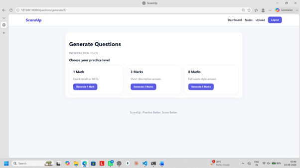
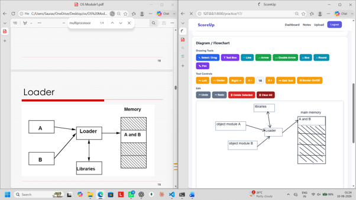
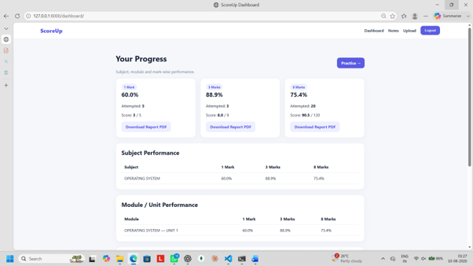
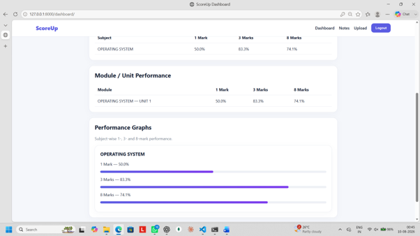
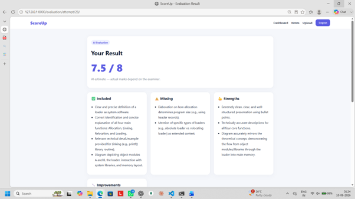

# ScoreUp

**Practice Better. Score Better.**

ScoreUp is a Django + Google Gemini project for exam preparation.

## Main flow

1. Register/login.
2. Upload study notes as PDF. (The assets folder contains some sample notes for testing.)
3. Generate 1-mark, 3-mark or 8-mark questions from the uploaded notes.
4. Practice MCQs or write answers.
5. For 8-mark questions, write online with a drawing canvas OR upload a handwritten answer as PDF.
6. Gemini evaluates the answer and provides an estimated score, missing points, strengths, improvements and "How to Score Better" guidance.

## Setup

### Windows

open terminal 
```bash

git clone https://github.com/Aurenox/ScoreUp.git
cd ScoreUp

```
Install Dependencies
```bash
pip install -r requirements.txt
```
Create `.env` from `.env.example` and add your Gemini API key.

Then:

```bash
python manage.py makemigrations
python manage.py migrate
```
Create an Admin User(optional)
```bash
python manage.py createsuperuser
```
Start the Django Server
```bash
python manage.py runserver
```
Open:

- http://127.0.0.1:8000/
- http://127.0.0.1:8000/admin/
## 📸 Screenshots

### Question Categories


### 8-Mark Drawing


### Progress


### Progress Details


### Practice Result



A complete collection of ScoreUp project screenshots is available here:

📄 [View Complete Project Screenshots](scoreup_screenshots.pdf)
## Important

- Keep `.env` private.
- The 8-mark PDF evaluator is an AI estimate, not an official examiner.
- PDF size is limited to 20 MB in this MVP.
